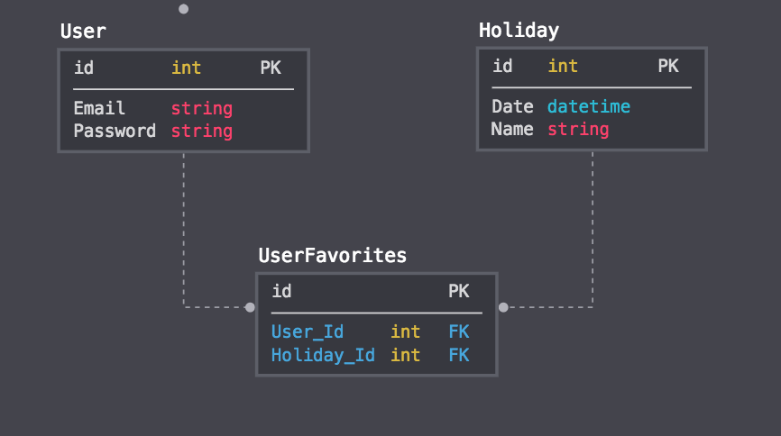

# Quirky Calendar

This app uses data from http://www.webcal.fi/en-US/other_file_formats.php to seed the database with fun holidays.  Visitors can query a date or a name to return holidays that match their query.  Visitors can also create accounts and favorite holidays.

## Getting Started

These instructions will get you a copy of the project up and running on your local machine for development and testing purposes.

From GitHub clone down repository using the following commands in terminal:
* `git clone git@github.com:jplao/quirky_calendar_be.git`
* `cd quirky_calendar_be`
* `rails db:{create,migrate,seed}`

### Prerequisites

You will need Rails installed and verify that it is version 5.2

To check your version using terminal run: `rails -v` in the command line.
If you have not installed rails, in terminal run: `gem install rails -v 5.2` in the command line.

### Using the App

#### Endpoints
To view these endpoints run your server using the command: `rails s`

#### Holidays on a Given Date
A user can query this endpoint with a date to show the fun holidays on that date.  Date must be formatted as YYYY-MM-DD.

example request:
````
GET localhost:3000/api/v1/holidays?date=2019-02-26
````

example response:
````json
{
    "data": [
        {
            "id": "190",
            "type": "holiday",
            "attributes": {
                "date": "2019-02-26T00:00:00.000Z",
                "name": "Carnival Day",
                "url": "http://holidayinsights.com/moreholidays/February/carnivalday.htm"
            }
        },
        {
            "id": "191",
            "type": "holiday",
            "attributes": {
                "date": "2019-02-26T00:00:00.000Z",
                "name": "For Pete's Sake Day",
                "url": "http://www.daysoftheyear.com/days/for-petes-sake-day/"
            }
        },
        {
            "id": "192",
            "type": "holiday",
            "attributes": {
                "date": "2019-02-26T00:00:00.000Z",
                "name": "Personal Chef Day",
                "url": "http://www.daysoftheyear.com/days/personal-chef-day/"
            }
        },
        {
            "id": "193",
            "type": "holiday",
            "attributes": {
                "date": "2019-02-26T00:00:00.000Z",
                "name": "Pistachio Day",
                "url": "http://holidayinsights.com/moreholidays/February/pistachioday.htm"
            }
        },
        {
            "id": "194",
            "type": "holiday",
            "attributes": {
                "date": "2019-02-26T00:00:00.000Z",
                "name": "Tell a Fairy Tale Day",
                "url": "http://www.daysoftheyear.com/days/tell-a-fairy-tale-day/"
            }
        }
    ]
}
````

#### Holidays Containing a Word
A user can query this endpoint with a word or group of words to show the fun holidays whose name includes that query. Query must be formatted with the first letter in every word capitalized.

example request:
````
GET localhost:3000/api/v1/search?name=Teddy
````

example response:
````json
{
    "data": [
        {
            "id": "660",
            "type": "holiday",
            "attributes": {
                "date": "2019-07-10T00:00:00.000Z",
                "name": "Teddy Bear Picnic Day",
                "url": "http://www.daysoftheyear.com/days/teddy-bear-picnic-day/"
            }
        },
        {
            "id": "783",
            "type": "holiday",
            "attributes": {
                "date": "2019-09-09T00:00:00.000Z",
                "name": "Teddy Bear Day",
                "url": "http://holidayinsights.com/moreholidays/September/teddybearday.htm"
            }
        },
        {
            "id": "854",
            "type": "holiday",
            "attributes": {
                "date": "2019-10-09T00:00:00.000Z",
                "name": "Bring Your Teddy Bear To Work & School Day",
                "url": "http://www.daysoftheyear.com/days/bring-your-teddy-bear-to-work-school-day/"
            }
        }
    ]
}
````

#### Create an account - api/v1/users

A user can create an account in our system by sending their data through the body of their request and will get a generated api key as a response.

example request:
````
POST localhost:3000/api/v1/users

body_form_data:
{
  email: abc@email.com,
  password: 123,
  password_confirmation: 123
}
````

example response:
````json
{
  "data": {
    "id": "1",
    "type": "user",
    "attributes": {
      "api_key": "Yerzr_KDZ80W8NTgsZpwLg"
    }
  }
}
````

#### Login - api/v1/sessions

A user can log into their account using the email and password they used to create their account and will get their api key as a response.

example request:
````
POST localhost:3000/api/v1/sessions

body_form_data:
{
  email: abc@email.com,
  password: 123
}
````

example response:
````json
{
  "data": {
    "id": "1",
    "type": "user",
    "attributes": {
      "api_key": "Yerzr_KDZ80W8NTgsZpwLg"
    }
  }
}
````

#### Favoriting Holidays - /api/v1/favorites

Using their generated API key, a user can add locations to their favorited locations.

example request:
````
POST localhost:3000/api/v1/favorites

body_form_data:
{
  holiday_id: 1,
  api_key: Yerzr_KDZ80W8NTgsZpwLg
}
````

example response:
````json
{
    "data": {
        "id": "1",
        "type": "holiday",
        "attributes": {
            "date": "2019-01-01T00:00:00.000Z",
            "name": "Bloody Mary Day",
            "url": "http://www.daysoftheyear.com/days/bloody-mary-day/"
        }
    }
}
````

#### Showing User Favorited Holidays
Using their API key, a user can generate a list of their favorited holidays.

example request:
````
GET localhost:3000/api/v1/favorites

body_form_data:
{
  api_key: Yerzr_KDZ80W8NTgsZpwLg
}
````

example response:
````json
{
    "data": [
        {
            "id": "1",
            "type": "holiday",
            "attributes": {
                "date": "2019-01-01T00:00:00.000Z",
                "name": "Bloody Mary Day",
                "url": "http://www.daysoftheyear.com/days/bloody-mary-day/"
            }
        },
        {
            "id": "35",
            "type": "holiday",
            "attributes": {
                "date": "2019-01-08T00:00:00.000Z",
                "name": "Poetry At Work Day",
                "url": "http://www.daysoftheyear.com/days/poetry-at-work-day/"
            }
        }
    ]
}
````


## Running the tests

* Note: Before running RSpec, ensure you're in the project root directory.

From terminal run: `bundle exec rspec`

After RSpec has completed, you should see all tests passing as GREEN.  Any tests that have failed or thrown an error will display RED.  Any tests that have been skipped will be displayed as YELLOW.

You can see all the tests by viewing the spec folder.  

### Request tests
Tests found in `/requests/api/v1` test to make sure endpoints display expected data correctly.

example test:
````ruby
require 'rails_helper'

describe 'as a visitor' do
  before(:each) do
    Holiday.create({date: "2019-02-01T00:00:00.000Z",
                    name: "Decorating With Candy Day",
                    url: "http://www.daysoftheyear.com/days/decorating-with-candy-day/"
        })
    Holiday.create({
                    date: "2019-10-30T00:00:00.000Z",
                    name: "Candy Corn Day",
                    url: "http://holidayinsights.com/moreholidays/October/candycornday.htm"
      })
    Holiday.create({
                    date: "2019-12-07T00:00:00.000Z",
                    name: "Cotton Candy Day",
                    url: "http://holidayinsights.com/moreholidays/December/cottoncandyday.htm"})
  end

  it 'gets current holidays' do
    get "/api/v1/search?name=Candy"

    expect(response).to be_successful

    holidays = JSON.parse(response.body, symbolize_names: true)
    expect(holidays[:data].count).to eq(3)
    first_holiday = holidays[:data][0][:attributes]
    expect(first_holiday[:date]).to eq("2019-02-01T00:00:00.000Z")
    expect(first_holiday[:name]).to eq("Decorating With Candy Day")
    expect(first_holiday[:url]).to eq("http://www.daysoftheyear.com/days/decorating-with-candy-day/")
  end
end
````

### Model tests
Tests found in `/models` test to make sure models have the correct validations and relationships, as well as test that methods work correctly.

````ruby
require 'rails_helper'

describe User, type: :model do
  describe 'validations' do
    it {should validate_presence_of(:email)}
    it {should validate_uniqueness_of(:email)}
    it {should validate_presence_of(:password)}
  end

  describe 'relationships' do
    it {should have_many(:favorites)}
  end

  describe 'instance methods' do
    it 'generates api key on create' do
      params = {
        email: "whatever@example.com",
        password: "password",
        password_confirmation: "password"
      }

      user = User.create(params)
      expect(user.api_key).not_to be_nil
    end
  end
end
````


## Built With

* Rails
* RSpec
* ShouldaMatchers
* SimpleCov
* PostgreSQL
* Faraday
* Figaro
* Bcrypt
* Fast JSON API

## Author

* Jennifer Lao - Github: [jplao](https://www.github.com/jplao)
